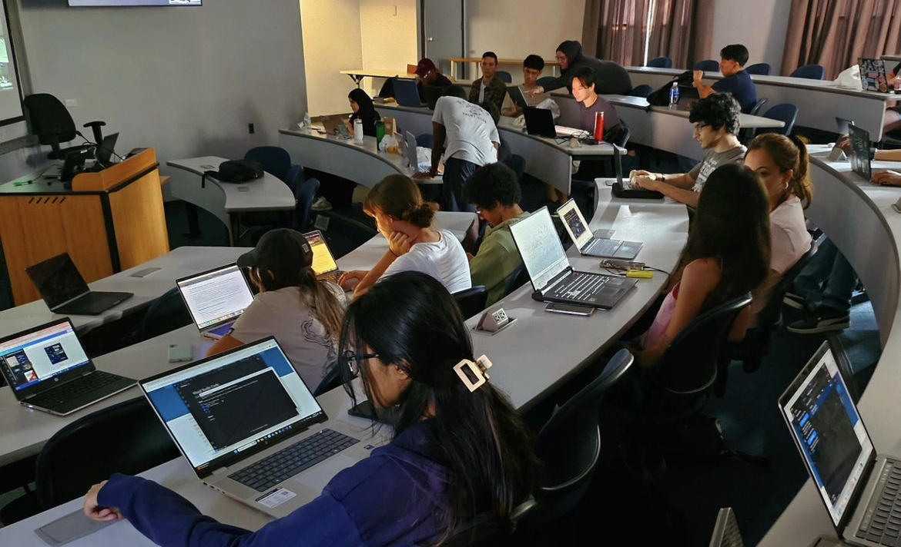

# ACM Club at Manhattan University

  

---

Welcome to the ACM Club at Manhattan University! We are a community of students passionate about computing, technology, and innovation. Our goal is to foster a collaborative environment where members can learn, share knowledge, and develop their skills.

## Table of Contents

- [About Us](#about-us)
- [Membership](#membership)
- [Events](#events)
- [Workshops](#workshops)
- [Projects](#projects)
- [Contact Us](#contact-us)

## About Us

The ACM (Association for Computing Machinery) Club at Manhattan University aims to connect students interested in computer science and related fields. We provide a platform for networking, professional development, and collaboration on projects.

### Mission

Our mission is to:
- Promote computer science education and awareness.
- Encourage networking among students and professionals.
- Provide opportunities for skill development through hands-on projects.

## Membership

Membership is open to all students at Manhattan University, regardless of major. To join, simply fill out our membership form [here](#).

### Benefits of Membership

- Access to exclusive workshops and events.
- Networking opportunities with industry professionals.
- Participation in group projects and hackathons.
- Access to resources and materials to enhance your skills.

## Events

We host a variety of events throughout the academic year, including:

- **Guest Lectures:** Learn from industry leaders about current trends and technologies.
- **Networking Events:** Connect with alumni and professionals in the field.
- **Hackathons:** Collaborate with peers to solve challenges and showcase your skills.

Stay updated on our upcoming events by following us on social media!

## Workshops

We conduct regular workshops on various topics, including:

- Programming languages (Python, Java, C++)
- Web development (HTML, CSS, JavaScript)
- Data science and machine learning
- Cybersecurity basics

If you have a topic you’d like us to cover, let us know!

## Projects

Members have the opportunity to work on projects that can enhance their portfolios. Whether you’re interested in web development, app creation, or data analysis, we encourage collaboration and innovation.

### Current Projects

- **Open Source Contributions**

Feel free to suggest new project ideas!

## Contact Us

Have questions or want to get involved? Reach out to us!

- **Email:** acm@manhattan.edu
- **Social Media:** Follow us on [Instagram](https://www.instagram.com/acm__mu/) for updates and announcements.

We look forward to having you join our community and contributing to the exciting world of computing!

---

**Last Updated:** [10/24/24]  
**Manhattan University ACM Club**

<!--
**acm-manhattan-university/acm-manhattan-university** is a ✨ _special_ ✨ repository because its `README.md` (this file) appears on your GitHub profile.

Here are some ideas to get you started:

- 🔭 I’m currently working on ...
- 🌱 I’m currently learning ...
- 👯 I’m looking to collaborate on ...
- 🤔 I’m looking for help with ...
- 💬 Ask me about ...
- 📫 How to reach me: ...
- 😄 Pronouns: ...
- ⚡ Fun fact: ...
-->
